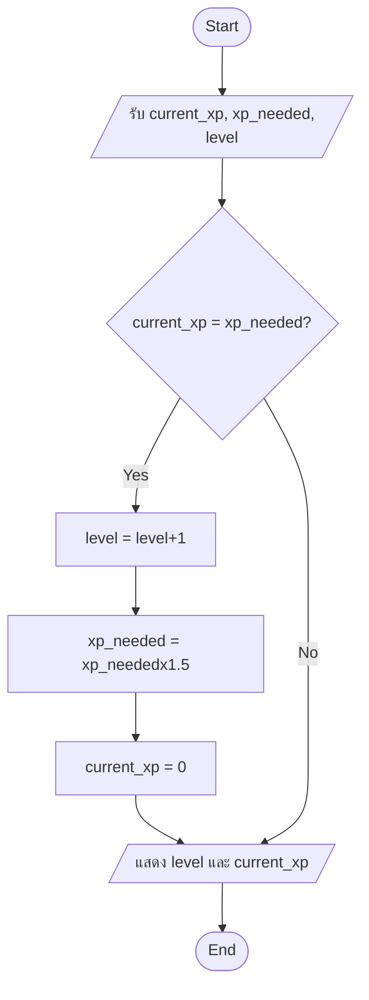

```mermaid
flowchart TD
Start([Start]) --> Input[/รับ current_xp, xp_needed,
level/]
--> D1{current_xp = xp_needed?}
D1 -->|Yes| Win[level = level+1]
--> Win1[xp_needed = xp_neededx1.5]
--> Win2[current_xp = 0]
--> input[/แสดง level และ current_xp/]
D1 -->|No| input[/แสดง level และ current_xp/]
--> End([End])
```
