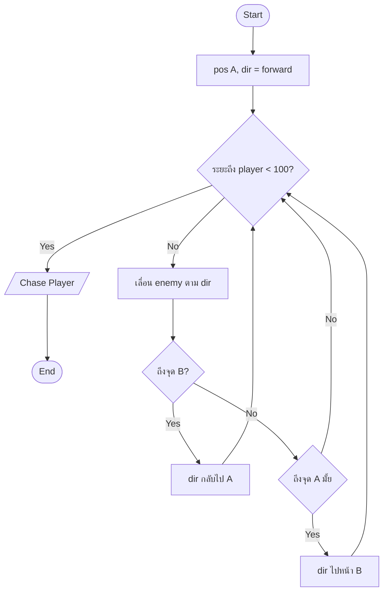

```mermaid
flowchart TD
Start([Start]) --> Input[pos A, dir = forward]
--> D1{ระยะถึง player < 100?}
D1 -->|Yes| C1[/Chase Player/]
--> End([End])
D1 -->|No| C2[เลื่อน enemy ตาม dir]
--> D2{ถึงจุด B?}
D2 -->|Yes| C3[dir กลับไป A]
--> D1{ระยะถึง player < 100?}
D2 -->|No| D3{ถึงจุด A มั้ย}
D3 -->|Yes| C4[dir ไปหน้า B]
--> D1{ระยะถึง player < 100?}
D3 -->|No| D1{ระยะถึง player < 100?}
```
